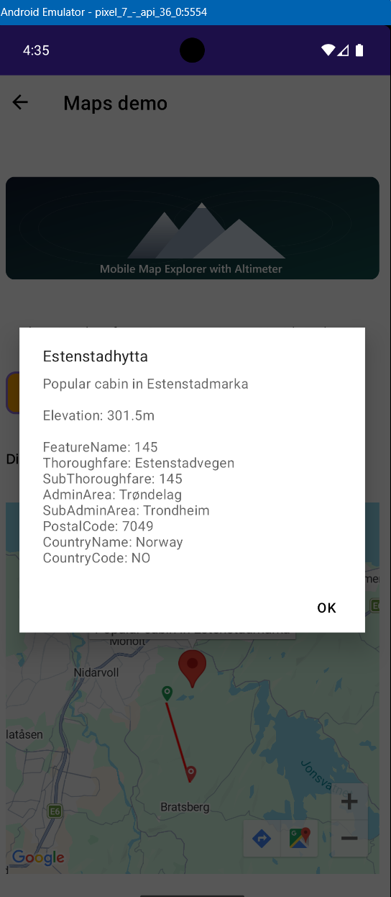

# MauiMapAppDemo

A small .NET MAUI map demo that shows cabin pins, map-click measurement mode, and custom marker icons for start and end measurement points.

## Highlights

- Cabin pins are rendered from the `MapsViewModel`.
- Measure mode lets you tap two points to draw a polyline and calculate distance.
- A map behavior keeps pin rendering, map clicks, and measurement graphics in one place.
- Custom SVG marker icons are used for the start and end measurement pins.

## Configuration

The app uses user secrets for local development keys.

- Google Maps key: stored in user secrets, not checked into source control.
- Azure Maps key: stored in user secrets, not checked into source control.

## Notes

- The measurement marker assets live under `Resources/Images/Markers`.
- The map page is in `Pages/MapsDemo.xaml`.
- The measurement behavior is in `Behaviors/MapPinsBehavior.cs`.

## Temporary Docs

The solution also includes temporary HTML notes in the root folder for quick review:

- `temp-maps-demo-blog.htm`
- `temp-maps-demo-code-details.htm`

## License 
Free to use ! 
This is just for fun, a hobby project to get familiar with .NET MAUI and map controls.

## Screenshots of the demo from the Android emulator    
   

<marquee>.NET Maui Map Demo - Cabin Pins, Measurement Mode, Custom Marker Icons</marquee>