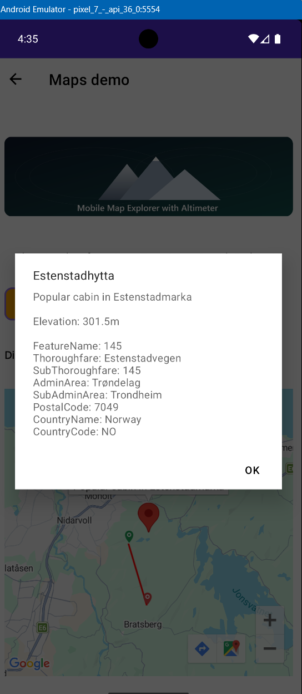
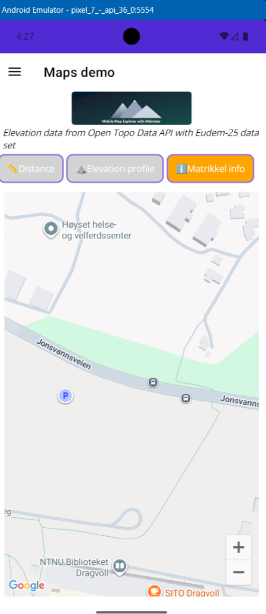
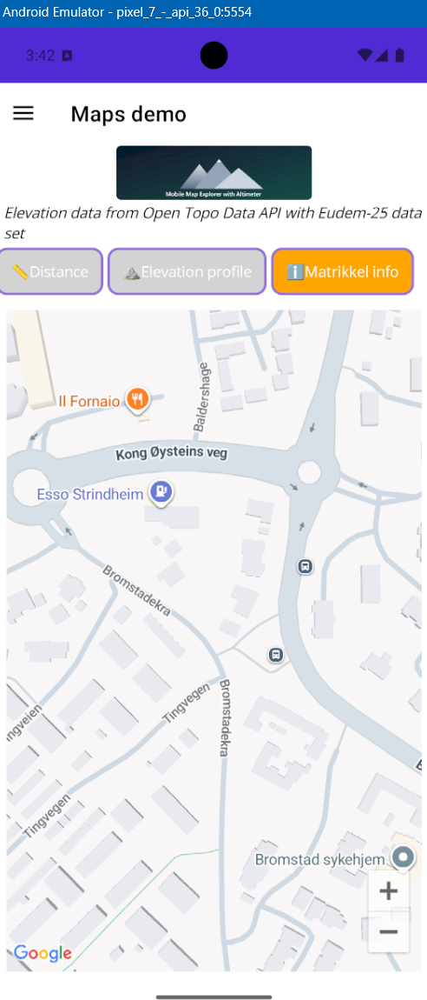
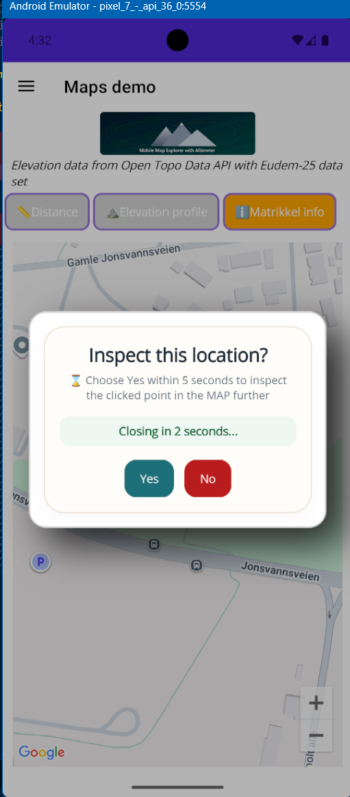
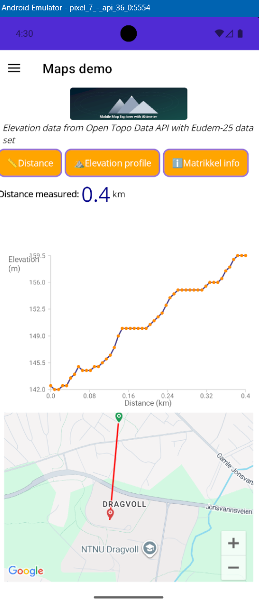

# MauiMapAppDemo

MauiMapAppDemo is a small .NET MAUI map demo focused on location picking, measurement, geocoding, elevation lookups, and Kartverket matrikkel data. It is a hobby project, but the code is organized as a practical reference for MAUI developers who want to see how map interactions, behaviors, and service-based lookups can fit together.

The project uses `CommunityToolkit.Mvvm` for fast MVVM development in MAUI. The viewmodel stays focused on state and commands, while the XAML page binds directly to those commands and properties.

## What It Does

- Renders cabin pins on the map from the viewmodel.
- Supports distance measurement by tapping two points and drawing the result.
- Shows elevation and placemark information for clicked locations.
- Looks up Kartverket Eiendom API v1 data for a clicked coordinate.
- Uses custom marker icons for measurement start and end points.

## XAML And Behaviors

The page wires the map up through behaviors so the visual layer stays thin and the interaction logic stays reusable.

```xml
<maps:Map Grid.Row="3"
		  x:Name="MapCtrl"
		  MapType="Street">
	<maps:Map.Behaviors>
		<behaviors:MapPinsBehavior
			BindingContext="{Binding Source={x:Reference MapCtrl}, Path=BindingContext}"
			Center="{Binding MapCenter}"
			PinItems="{Binding CabinPins}"
			IsMeasuringMode="{Binding IsMeasuringMode}"
			IsMatrikkelMode="{Binding IsMatrikkelMode}"
			MeasureStart="{Binding FirstLocationMeasureMode}"
			MeasureEnd="{Binding SecondLocationMeasureMode}"
			MapClickedCommand="{Binding MapClickedCommand}"
			PinClickedCommand="{Binding PinClickedCommand}" />
</maps:Map.Behaviors>
```

The behavior listens for map clicks and pin updates, then keeps the pin rendering and measurement overlay logic out of the page code-behind.

```csharp
public static readonly BindableProperty PinItemsProperty =
	BindableProperty.Create(
		nameof(PinItems),
		typeof(IEnumerable<MapPinModel>),
		typeof(MapPinsBehavior),
		propertyChanged: OnPinItemsChanged);

protected override void OnAttachedTo(Microsoft.Maui.Controls.Maps.Map bindable)
{
	_map = bindable;
	WireUpMapClickedCommand(bindable);
	base.OnAttachedTo(bindable);
	RefreshPins();
}
```

## MVVM Toolkit

`CommunityToolkit.Mvvm` keeps the viewmodel compact and avoids a lot of boilerplate.

```csharp
[ObservableProperty]
private bool _isMeasuringMode;

[RelayCommand]
private async Task MapClicked(Location location)
{
	if (IsMeasuringMode)
	{
		await HandleMeasuringMode(location);
		return;
	}

	await HandleDefaultMapClicked(location);
}
```

That pattern makes the MAUI page mostly declarative: properties drive the UI, and commands drive the interaction flow.

## Services

The app is intentionally split into small map-related services so the viewmodel stays readable and the lookup logic stays easy to replace.

- `GeocodingService` wraps MAUI geocoding and returns a compact placemark description for clicked coordinates.
- `IElevationService` abstracts elevation lookups so the app can switch between providers without changing the map flow.
- `OpenTopoService` provides elevation from OpenTopoData.
- `GoogleElevationService` provides elevation from Google Maps when configured.
- `KartverketService` calls Kartverket Eiendom API v1 for point-based matrikkel lookups.

### Kartverket background

Kartverket’s current eiendom API is the modern entry point for point-based property lookup in Norway. The older GAB registeret, which covered grunneiendom, adresse og bygning, was part of the path toward a more unified matrikkel model. Today the Matrikkelen is the authoritative cadastre system, and the API in this demo is a convenient way to query point-adjacent property data from it.

The popup in this project shows the most relevant fields first, then adds a few short explanations so the response is easier to read for developers and testers.

## Configuration

Local development uses user secrets for keys and tokens.

- Google Maps key: stored in user secrets, not checked into source control.
- Azure Maps key: stored in user secrets, not checked into source control.
- The elevation provider can be switched via app configuration.

## Project Notes

- The map page lives in `Pages/MapsDemo.xaml`.
- The main map logic lives in `ViewModels/MapsViewModel.cs`.
- Custom pin rendering and measurement graphics live in `Behaviors/MapPinsBehavior.cs`.
- Measurement marker assets live under `Resources/Images/Markers`.

## Screenshots












## License

MIT License.

This is a hobby project made for learning and experimentation with .NET MAUI, maps, and location-based services.

<marquee>.NET MAUI Map Demo - Cabin Pins, Measurement Mode, Custom Marker Icons, Geocoding, Elevation, and Kartverket</marquee>